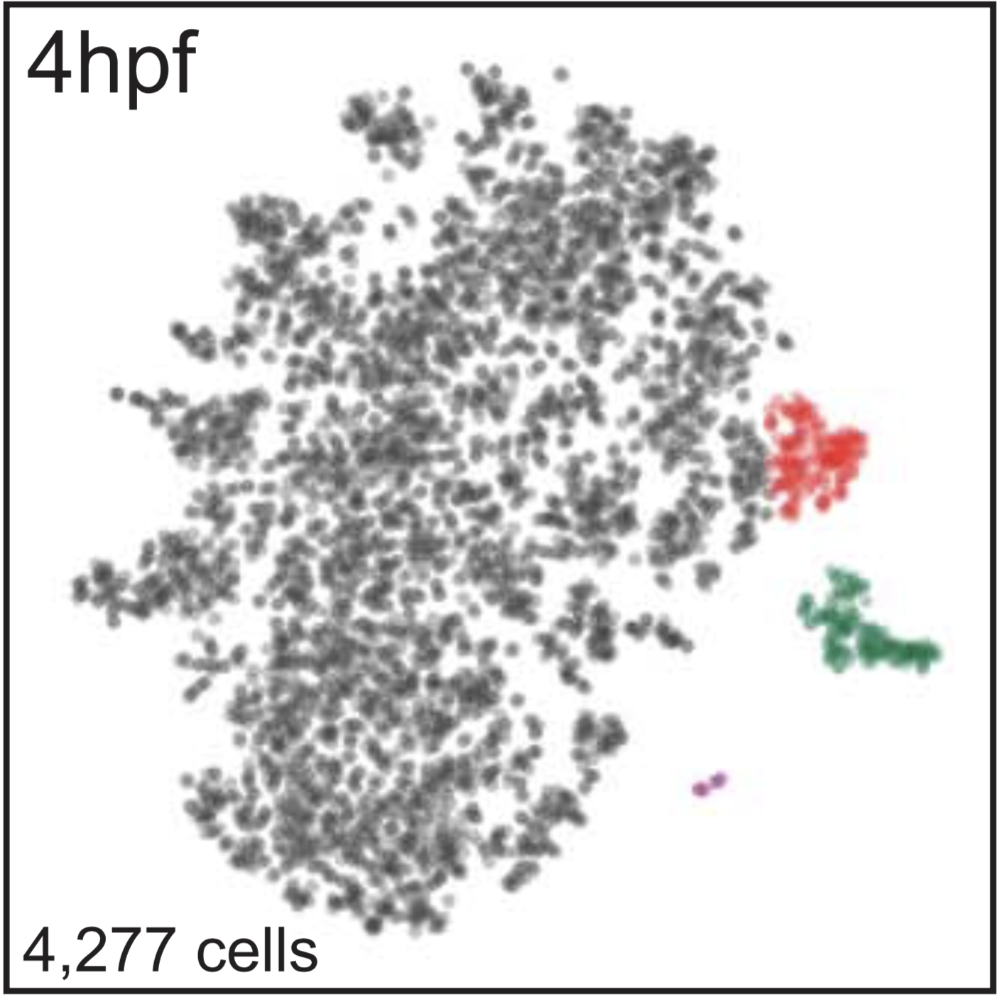

# This is a GitHub-flavored markdown copy of the `make_fig.Rmd` file
This is just so you can see the file contents on GitHub (code is not executable inline).
You could copy and paste the code into R or RStudio running on your own computer.

Take a look around the integrated development environment (IDE). This is your code writing box, where you can script code. Below (bottom left) you will see your console and terminal. The console is where you run the code and see results. The terminal allows you to move around in your computer. In the top right, focus on the environment tab. This is where variables, values, and loaded functions are stored. Finally, look to the bottom right. Here you can see files on your computer, see plots, see loaded packages, and get help.

### Reference: Wagner et al., 2018 (Allon Klein)

http://science.sciencemag.org/content/360/6392/981

We want to reproduce a figure from the Klein paper. The easiest one is Figure 1B. This file and the data in the `/QSCBC/Data/Klein_fig1` directory should be all you need to reproduce the *4hpf* figure. Here is a picture of the figure we are trying to reproduce: 

One of the first things you should do when you start an R session is to see what is in your environment.

``` {r}
sessionInfo()
```

The next step is to load required packages for your analysis. In this case, you will need two packages: (1) Seurat - a package for scRNAseq data analysis; and (2) dPlyr - a package for data manipulation/summarization.

``` {r}
getPackageIfNeeded <- function(pkg) {
  if (!require(pkg, character.only=TRUE))
    install.packages(pkgs=pkg, dependencies=TRUE)
}

pkgs <- c("Seurat","plyr","dplyr")

temp <- sapply(pkgs, getPackageIfNeeded)
```

The data are in a different directory than this file. We will make an object of the path to the data relative to the current directory (assuming you are starting in the directory where this files exists: in `R_code/Klein_paper` or in your own `R_code` directory).

``` {r}
data_path <- '../../Data/Klein_fig1'
```

Now, we need to read in the data. For single-cell RNA sequencing, this data is a matrix of cells with read counts. This is a large dataset, so it may take a few seconds. Then inspect the first five rows and columns of data.

``` {r}
compfile <- file.path(data_path,"GSM3067189_04hpf_nm.csv.zip")
raw_counts <- read.table(unz(compfile, "GSM3067189_04hpf_nm.csv"),
                         sep = ",", header = TRUE, row.names = 1)
raw_counts[1:5,1:5]
```

This dataset is large. To compress the data into a more manageable form use the *Seurat* R package to create a new object and clean the dataset.

``` {r}
hpf4 <- CreateSeuratObject(raw.data = raw_counts, min.cells = 3,
                           min.genes = 200, project = "hpf4")
```

The data came pre-normalized (you can ignore the warnings below). However, we need to identify features (genes) that define the data and scale the data so the gene counts are not too low.

``` {r}
hpf4 <- FindVariableGenes(hpf4, do.plot = F)
hpf4 <- ScaleData(hpf4, display.progress = T)
```

Ok, so now we can do some dimensionality reduction and plotting of the data. Principal Component Analysis (PCA) identifies the axes of most variance in the dataset. By projecting the data on the axes with the most variance, one can identify groups that exist in the high dimensional space.

``` {r}
hpf4 <- RunPCA(object = hpf4,
              pc.genes = hpf4@var.genes,
              genes.print = 10)

PCAPlot(object = hpf4)
```

Another dimensionality reduction technique used in single-cell data analysis is t-distributed Stochastic Neighbor Embedding (tSNE). This is a non-linear reduction approach that can emphasize local and global similarities better than PCA.

``` {r}
# tSNE is run on the first 10 principal components (for speed)
hpf4 <- RunTSNE(object = hpf4,
                    dims.use = 1:10,
                    do.fast = TRUE)

# Color both replicates the same color
colors <- c("DEW050"="grey", "DEW051"="grey")

TSNEPlot(object = hpf4) +
  scale_color_manual("4hpf", values = colors)
```

So, now we have some semantics. How do we plot data exactly as it appears in the paper? The short answer is that with a tool like tSNE, it is almost impossible. Because the process is stochastic, every run of tSNE can be different. However, the authors do provide information on how each cell was clustered. So, we will overlay that information on the tSNE plot.

``` {r}
labels <- read.csv(file.path(data_path,"GSM3067189_04hpf_clustID.txt"),
                   header = F,
                   row.names = row.names(hpf4@meta.data))
colnames(labels) <- "cluster"
hpf4 <- AddMetaData(hpf4, labels, col.name = 'cluster')
hpf4 <- SetAllIdent(object = hpf4, id = 'cluster')

TSNEPlot(object = hpf4)
```

Ok, starting to look better. Now, we need to change those cluster identifiers to biological identifiers. The authors provide a file for that as well. We will intersect those two pieces of information, and overlay the biological identifiers on the plot.

``` {r}
names <- read.csv(file.path(data_path,"GSE112294_ClusterNames.csv"))
names_hpf4 <- names[1:4,]
names_hpf4$cluster <- c("Epidermal", "Mesoderm", "Epiblast", "Germline")
names_hpf4_sub <- names_hpf4[c("ClusterID", "cluster")]
colnames(names_hpf4_sub) <- c("cluster", "name")

test_join <- join(hpf4@meta.data, names_hpf4_sub, by = "cluster")
rownames(test_join) <- row.names(hpf4@meta.data)
cluster_names <- test_join["name"]
hpf4 <- AddMetaData(hpf4, cluster_names, col.name = 'name')
hpf4 <- SetAllIdent(object = hpf4, id = 'name')

TSNEPlot(object = hpf4)
```

Finally, we want to match the colors and add some plot annotations (experiment name and number of cells). Here, the colors and text are added to the plot.

``` {r}
TSNEPlot(object = hpf4) + ylim(-35,35) + xlim(-40,35) +
  geom_text(x=-25, y=-32, label=sprintf("%d cells", nrow(hpf4@meta.data))) +
  geom_text(x=-25, y=32, label="4hpf") +
  scale_color_manual(labels=c("Epiblast","Epidermal","Germline","Mesoderm"),
                     values=c("grey50", "darkgreen", "purple", "red"))
```
